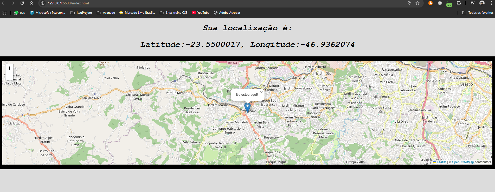

# Projeto mapa de localização

## Resumo do projeto
- Projeto para mapear e mostrar sua localização em real time
- Com isso você pode ficar mais interado da sua localização e saber pontos proximos no qual deseja chegar.

### Tecnologias usadas no desenvolvimento
- HTML
- CSS
- Javascript
